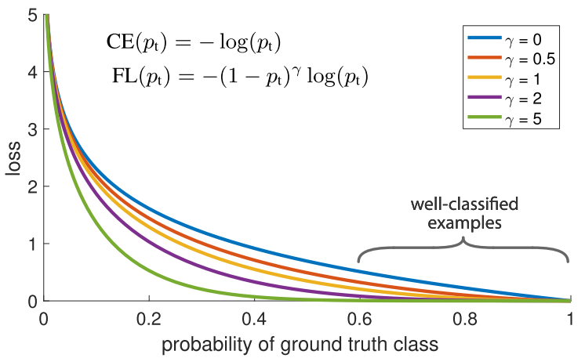

# Focal Loss

This is the keras implementation of focal loss proposed by Lin et. al. in their [Focal Loss for Dense Object Detection](https://arxiv.org/abs/1708.02002) paper.

## Usage

Compile your model with focal loss as follows:

for binary

`model.compile(loss=[binary_focal_loss(gamma=2)], metrics=["accuracy"], optimizer="adam")`

for categorical

`model.compile(loss=[categorical_focal_loss(gamma=2)], metrics=["accuracy"], optimizer="adam")`

### alpha setting:

`model.fit(class_weight={0:alpha0, 1:alpha1, ...}, ...)` the class_weight is the alpha of focal loss.

## References

The implementation is based [@umbertogriffo](https://github.com/umbertogriffo/focal-loss-keras)
